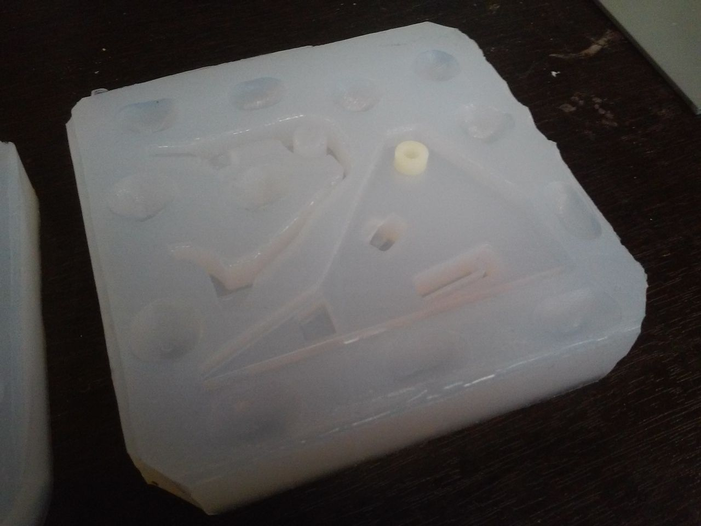
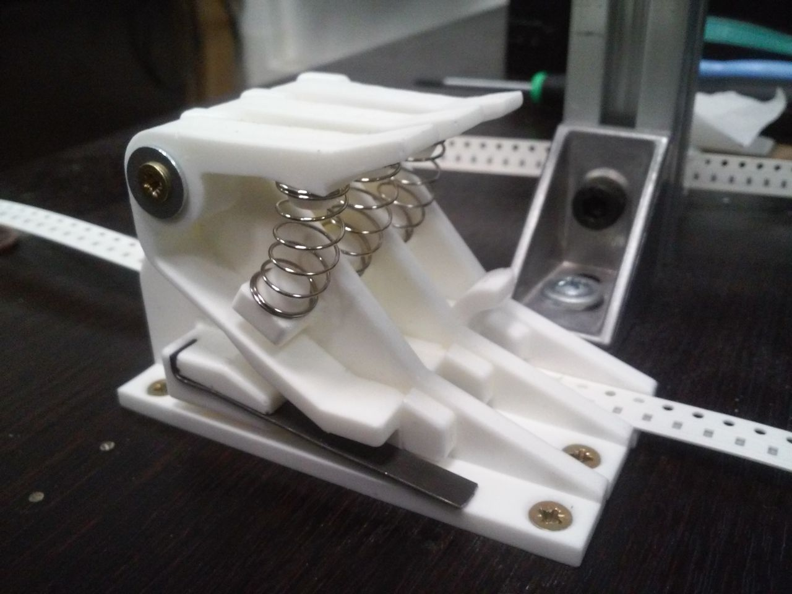

# litefeeder

Semi-automatic passive printable/castable SMD tape feeder for LitePlacer (should work with other pick and place machines with some adjustments).

Watch it in action: https://www.youtube.com/watch?v=S1jxeCK4YC0

Discussion: https://liteplacer.com/phpBB/viewtopic.php?f=11&t=6272

## General notes

The design is inspired by alexavr2's alexfeeder https://github.com/alexavr2/alexfeeder https://alex-avr2.livejournal.com/210450.html and Karl Ekdahl's clockwork feeder https://liteplacer.com/phpBB/viewtopic.php?f=11&t=191 https://vimeo.com/144454867 http://www.knasmusic.com/diyeverything/pickandplace/tapefeeders.php . It is easy to manufacture as the former and requires no additional motion as the latter.

However i think the best cheap feeder design is that found in chinese machines. https://youtu.be/GKw8WOlGR84?t=131 https://youtu.be/y14pdfjYsyo But it requires software support, also i did not find the tape pulling rod assembly sold separately in chinese stores, and i think it should be problematic to attach such assembly to an existing machine.

### Pros

* No software support required.
* No extra machine head movement required.
* No extra electronics required.
* Easy to manufacture.
* Low cost (about $1 per feeder without labor).

### Cons

* Can only feed 8/4 mm (and maybe 12/4 mm) tape.
* Does not peel the film. You can use 150 - 200 g weights for this or make film peeler as in chinese machines or alexfeeder.

## Manufacturing

### Parts needed

* 0.5*5 mm flat spring. https://www.aliexpress.com/item/32826247091.html
* 0.5*8*25 mm coil spring (20 mm may be fine too). https://www.aliexpress.com/item/33054199528.html
* 1.2 mm round nylon line for the tooth (1 mm may be fine too, also you can use metal pins from headers, but it requires additional filing).
* Super glue.
* 7*11 mm nylon spacers for the axle (optional, not needed if you print directly). https://www.aliexpress.com/item/32868508973.html
* Two 2.5*20 mm wood screws.
* One M3*35 screw for machine head.
* One plastic cap for machine head. I use M3 acorn nut https://www.aliexpress.com/item/32963279606.html , but you can use (rounded) M3 long nylon nut https://www.aliexpress.com/item/33002921745.html for better height adjustment or print your own cap.

### [Printing and casting](casting.md)

You can make it with your favorite technology, but if you have no 3d printer at all, or your prints are not strong enough, and/or you prefer casting over 3d printing, you may want to read my [casting description](casting.md).

### Assembly

Drill 1.2 mm hole at about 45° at the end of the dog.

Glue 1.2 mm nylon line into this hole.

<!----->

Cut the line flush to the vertical face. So we have durable nylon tooth that will push the tape by its holes. You can also use metal pins, nails or whatever you want, but i think nylon line is the easiest way.

Bend and cut the flat spring so its long side is 43 - 44 mm and short side is 2 - 3 mm.

<!----->

Assemble the feeder.

<!----->
<!----->

Replace one of the screws that hold the lower linear bearing with the 35 mm screw and attach the cap nut so your machine can push the lever.

It's time to ruin the table where the machine rests. But before this you need to determine the right Y position for your feeders. Insert some tape into the feeder and push the lever several times. Now you know that it works (hopefully) and the machine nozzle should be above the first part cell not covered by the spring. Try to find such Y position that your feeder pickup coordinate will be almost at the lowest allowed Y coordinate (it is -3 mm in case of the liteplacer, so aim to about -2 mm).

<!----->

Print the feeder_screw_template.pdf and stick it to the table (ideally, but not necessary, parallel to the X axis). So your feeders will sit on the table with exactly 12 mm pitch. 

Punch holes at the line crossings.

Drill 1.5 mm holes.

<!----->

Drill 45° 8.5 - 10 mm hole for each feeder into which the used tape will be discarded (not pictured yet). At the first time you may use existing camera hole (the camera is anyway useless with the existing liteplacer software).

Screw some feeders.

<!----->

Invent some reel mount and film peeling mechanism.

Profit!
