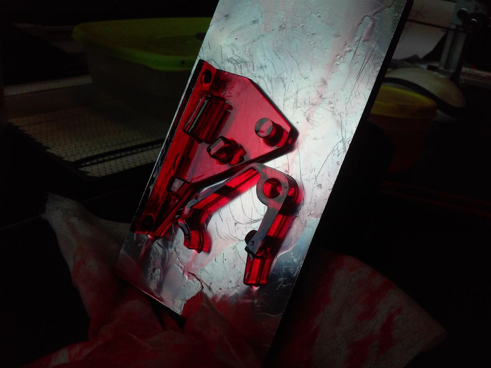
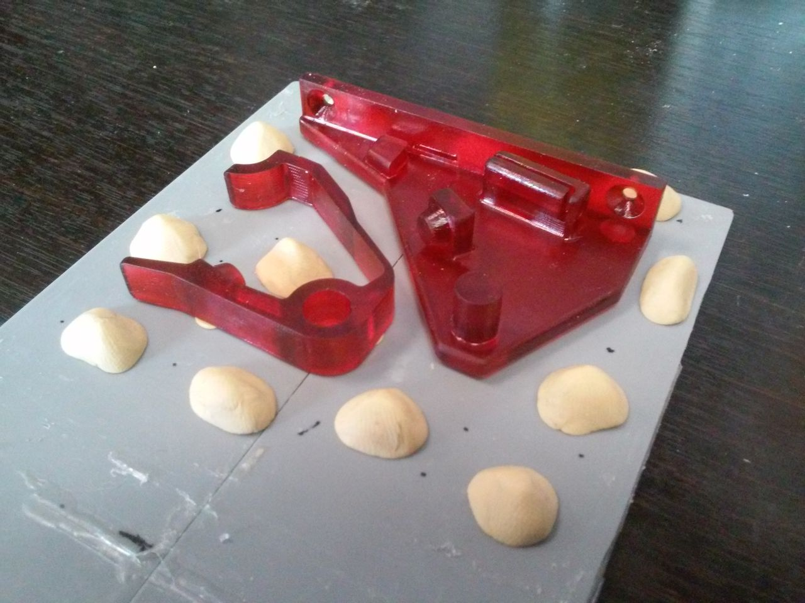
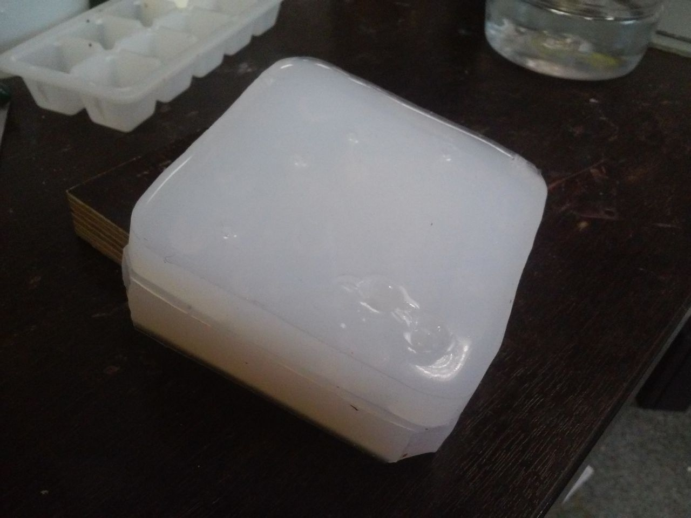
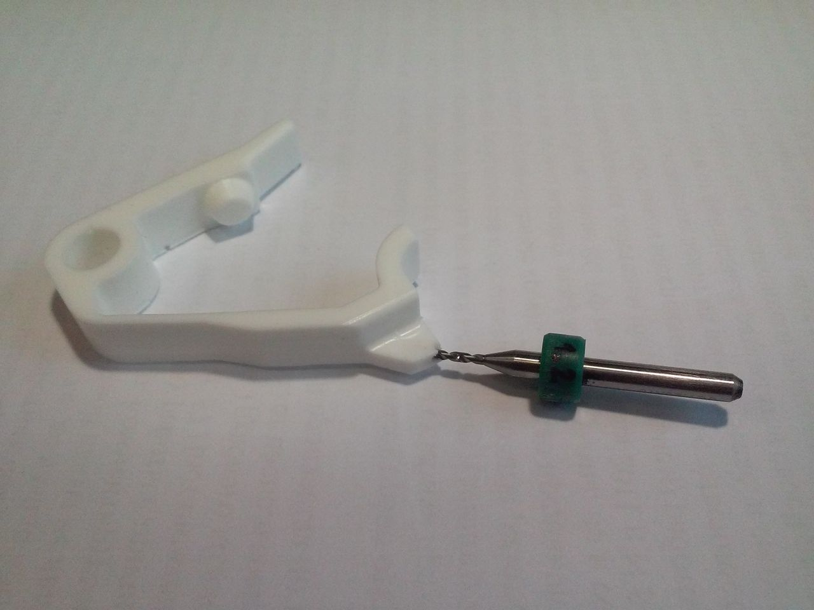
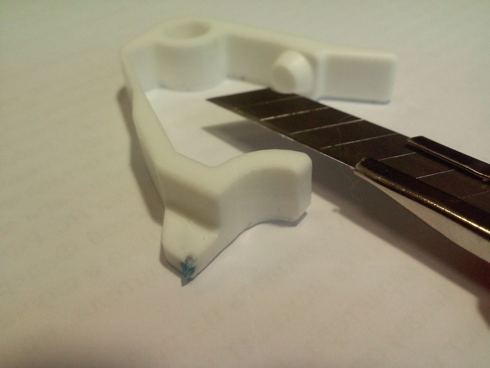
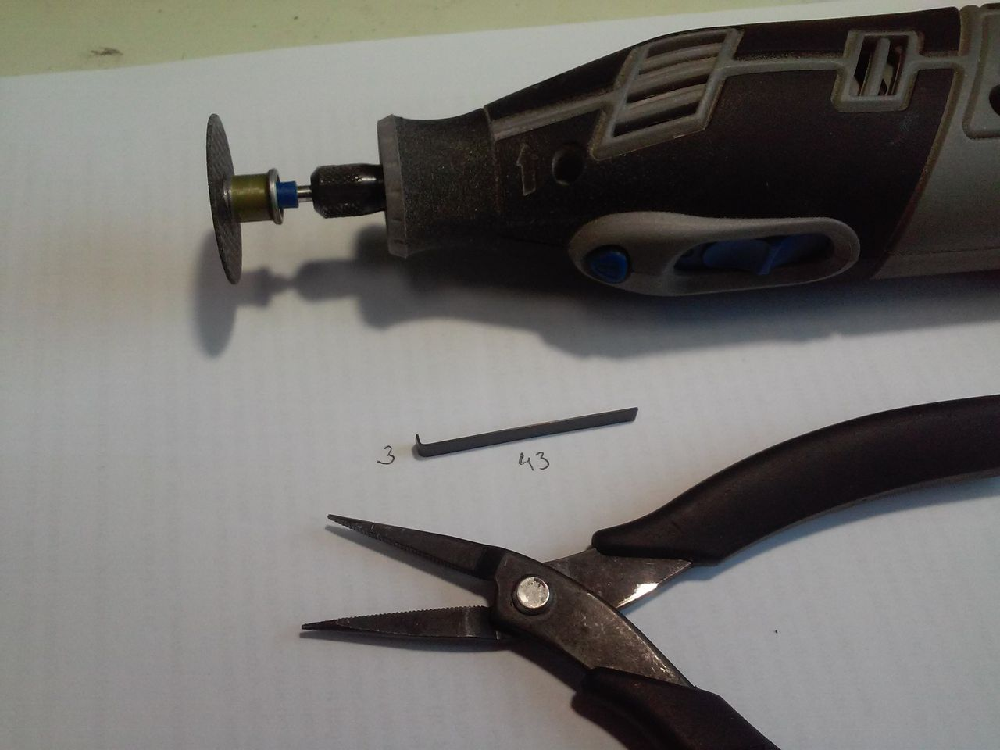
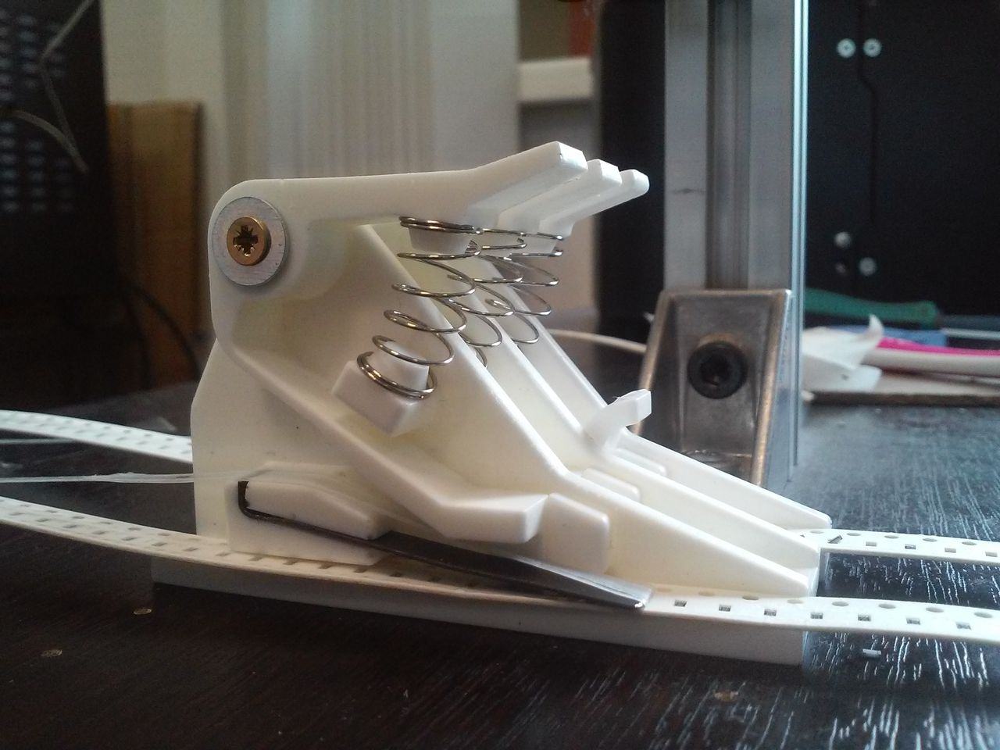
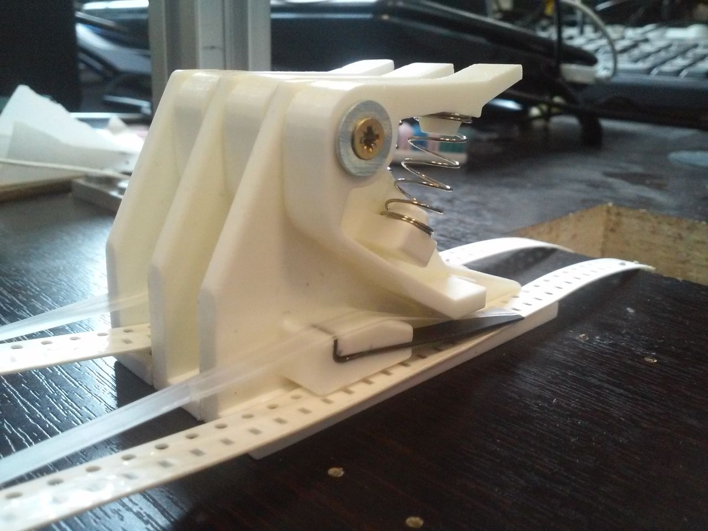
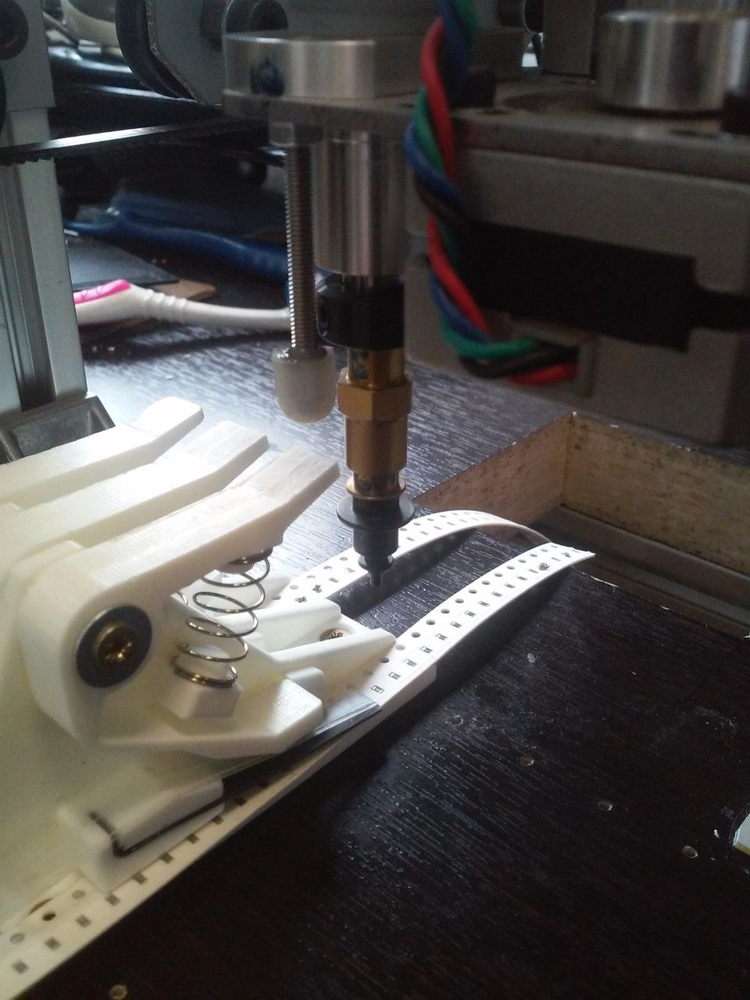
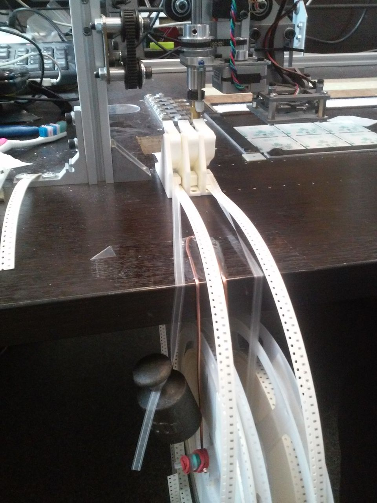

# litefeeder

Semi-automatic passive printable/castable SMD tape feeder for LitePlacer (should work with other pick and place machines with some adjustments).

Watch it in action: https://www.youtube.com/watch?v=S1jxeCK4YC0

Discussion: https://liteplacer.com/phpBB/viewtopic.php?f=11&t=6272

## General notes

The design is inspired by alexavr2's alexfeeder https://github.com/alexavr2/alexfeeder https://alex-avr2.livejournal.com/210450.html and Karl Ekdahl's clockwork feeder https://liteplacer.com/phpBB/viewtopic.php?f=11&t=191 https://vimeo.com/144454867 http://www.knasmusic.com/diyeverything/pickandplace/tapefeeders.php . It is easy to manufacture as the former and requires no additional motion as the latter.

However i think the best cheap feeder design is that found in chinese machines. https://youtu.be/GKw8WOlGR84?t=131 https://youtu.be/y14pdfjYsyo But it requires software support, also i did not find the tape pulling rod assembly sold separately in chinese stores, and i think it should be problematic to attach such assembly to an existing machine.

### Pros

* No software support required.
* No extra machine head movement required.
* Easy to manufacture.
* Low cost (about $1 per feeder without labor).

### Cons

* Can only feed 8/4 mm (and maybe 12/4 mm) tape.
* Does not peel the film. You can use 150 - 200 g weights for this or make film peeler as in chinese machines or alexfeeder.

## Manufacturing

### Parts needed

* 0.5*5 mm flat spring.
* 0.5*8*25 mm coil spring (20 mm may be fine too).
* 1.2 mm round nylon line for the tooth (1 mm may be fine too, also you can use metal pins from headers, but it requires additional filing).
* Super glue.
* 7*11 mm nylon spacers for the axle (optional, not needed if you print directly).
* Two 2.5*20 mm wood screws.

### Printing and casting

You can make it with your favorite technology, but bear in mind that it contains plastic spring and rubbing parts, so the plastic should be strong and durable to some extent. For example, UV photopolymers for LCD printers (at least that i have) do not meet this requirements (and also my printer prints quite slowly), so i had to cast my feeders from polyurethane (Smooth-Cast 305).

<!----->

<!----->

### Assembly

<!----->

<!----->

<!----->
<!----->

