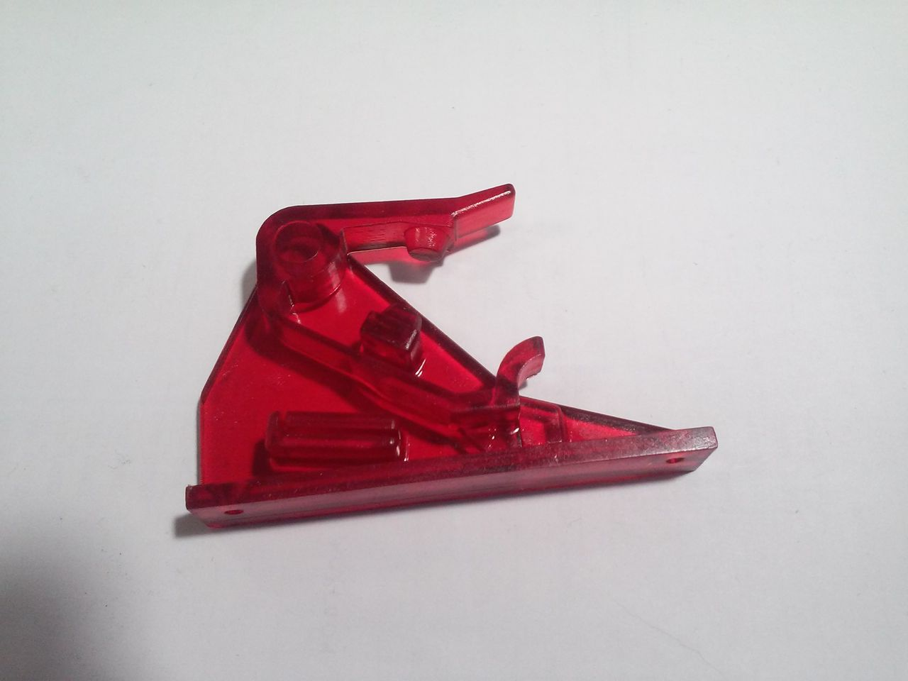
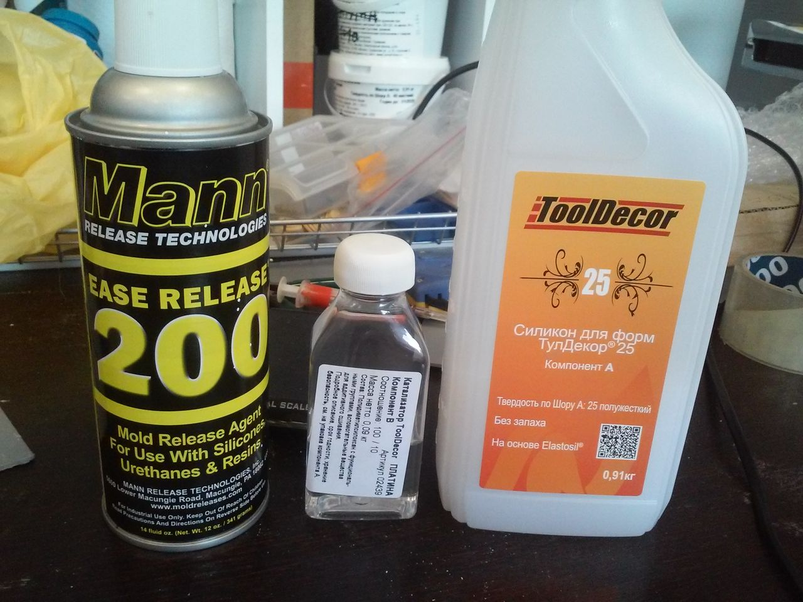
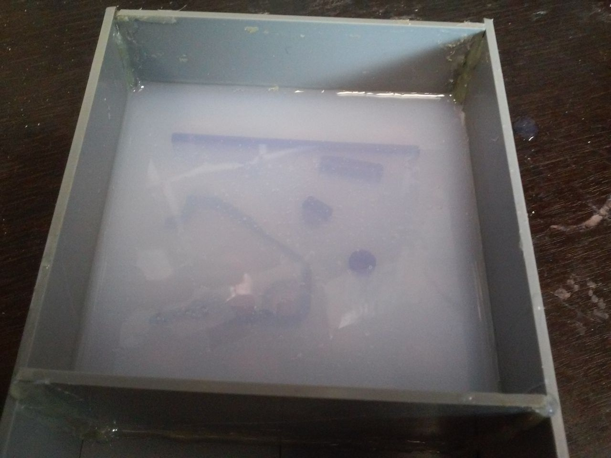
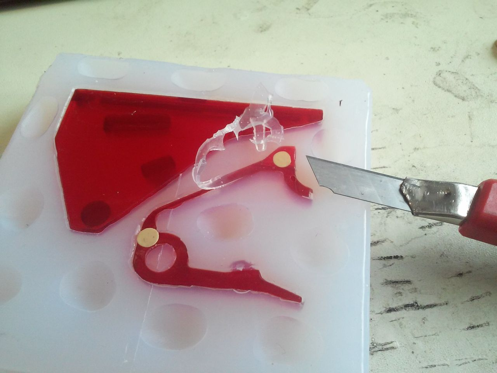
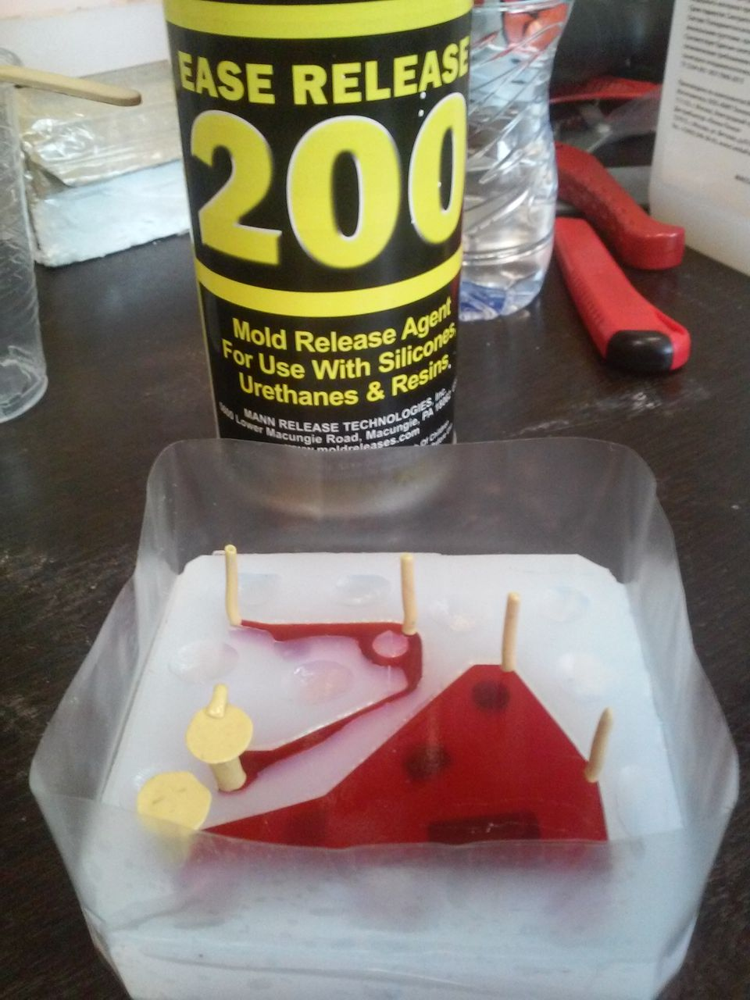
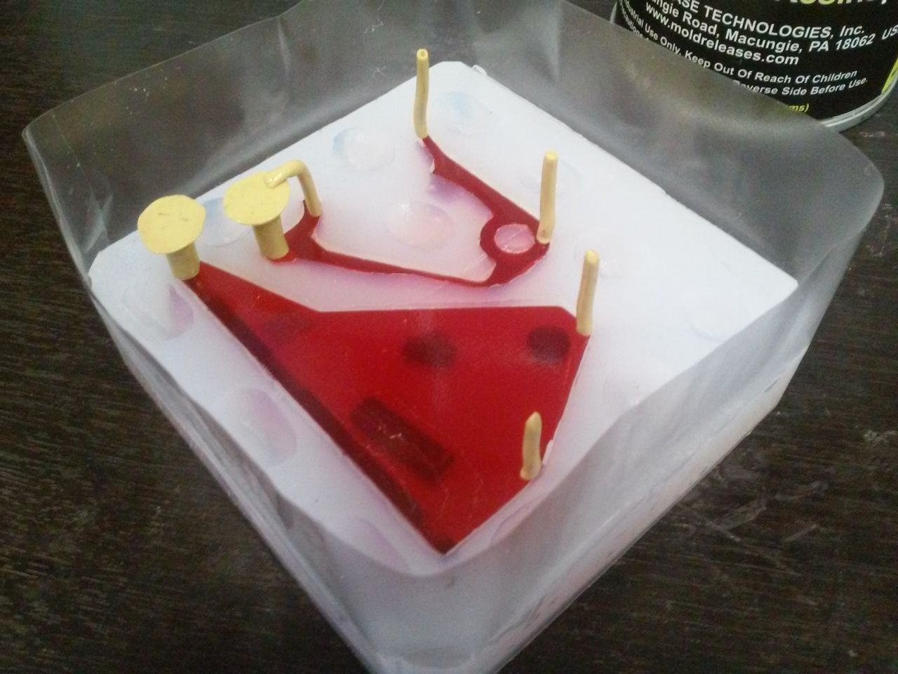
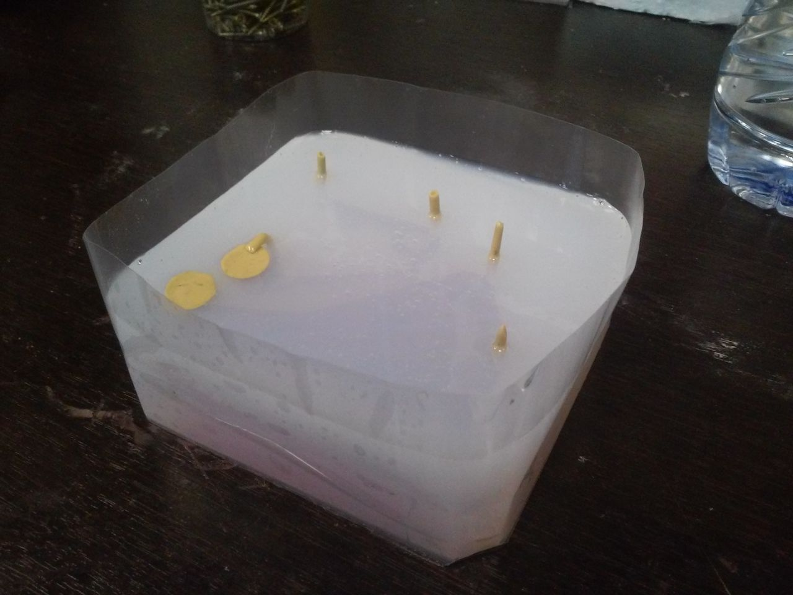
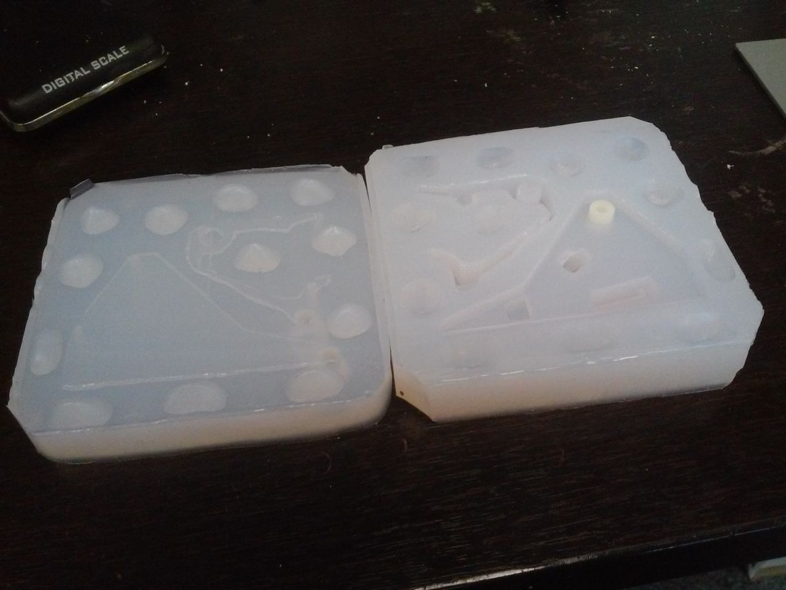
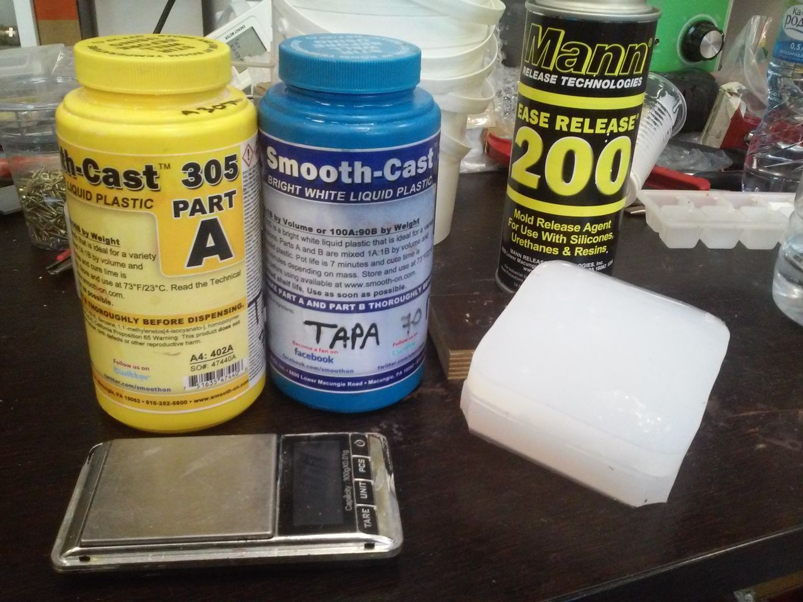

# Printing and casting the litefeeder

You can make it with your favorite technology, but bear in mind that it contains plastic spring and rubbing parts, so the plastic should be strong and durable to some extent. For example, UV photopolymers for LCD printers (at least that i have) do not meet this requirements (and also my printer prints quite slowly), so i had to cast my feeders from polyurethane (Smooth-Cast 305).

There are number of polyurethane casting tutorials on youtube, e. g. https://www.youtube.com/watch?v=YGZ2OeQinzw https://www.youtube.com/watch?v=DEVi0mEaJJQ

Platinum silicones are generally better, but they are incompatible with most photopolymers with notable exception of Gorky Liquid Simple https://gorkyliquid.ru/catalog/fotopolimer-dlya-3d-printera/fotopolimernaya_smola_gorky_liquid_simple_krasnaya_1_kg which is quite good by other parameters and also is the cheapest photopolymer in my country. If you can not purchase this resin, try finding another platinum silicone compatible photopolymer or use tin silicone. "Protective coatings" do not work, at least to me.

Release agent is mandatory, especially when pouring second half of the silicone mold over the first half. I use Ease-Release 200. When casting polyurethane, applying release agent before each casting is not necessary, but it is good to apply it every 2 - 3 castings.

Each mold lasts for about 10 - 20 castings (30 if you are lucky, but it slightly grows with each casting).

Sculpt some keys from modeling clay and glue the feeder parts with the same clay. It is said that some clays are incompatible with platinum silicones, but all my clays work fine.

Remove excess silicone.

<!----->

Quick and dirty vessel for the second half. Apply release agent! And do not forget spouts and vents.

Insert nylon axle if you have them (but it also works without it).

<!----->

Extract the casting after about 40 - 50 minutes, remove spouts and vents and wait about 24 hours for polyurethane to fully cure. Or you can bake it in an oven at 60°C for 3 hours as the manual says.
